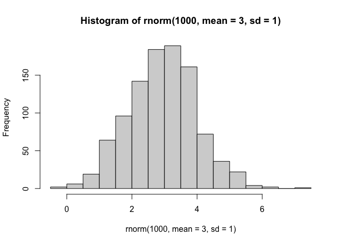
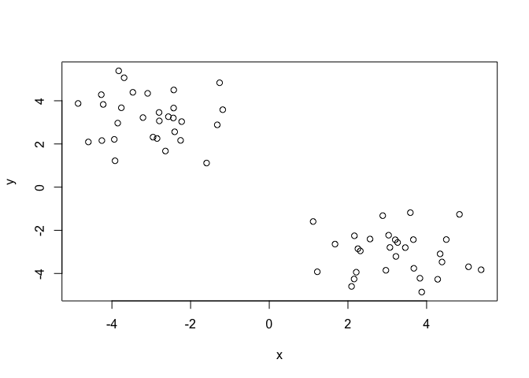
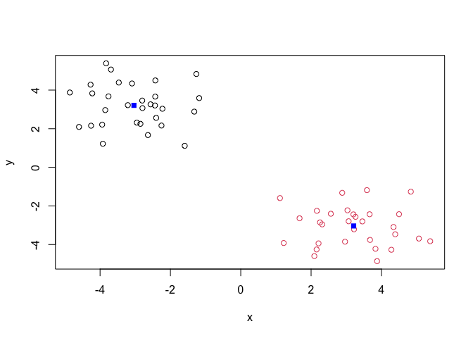
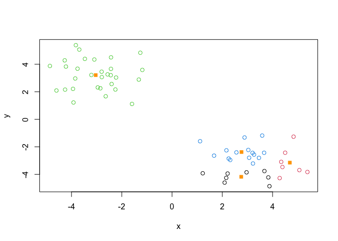
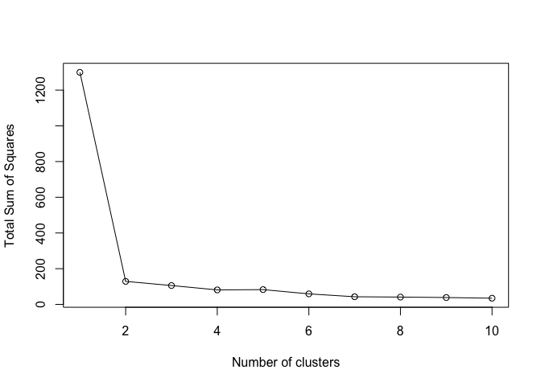
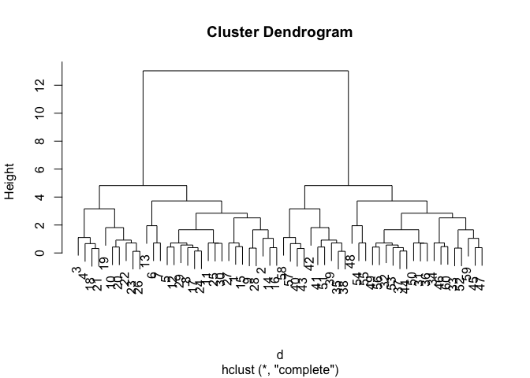
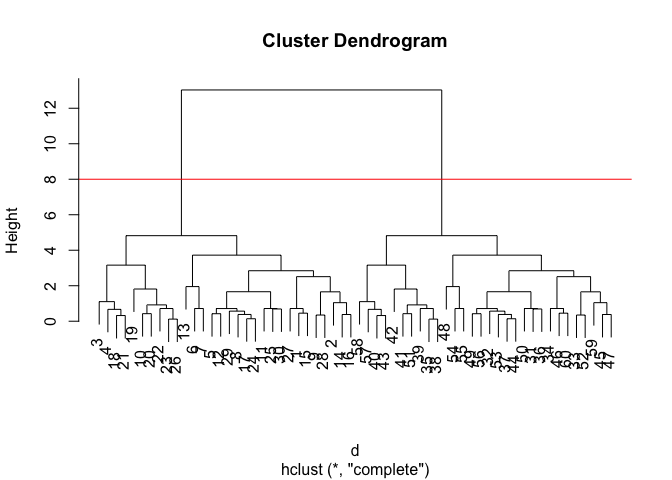
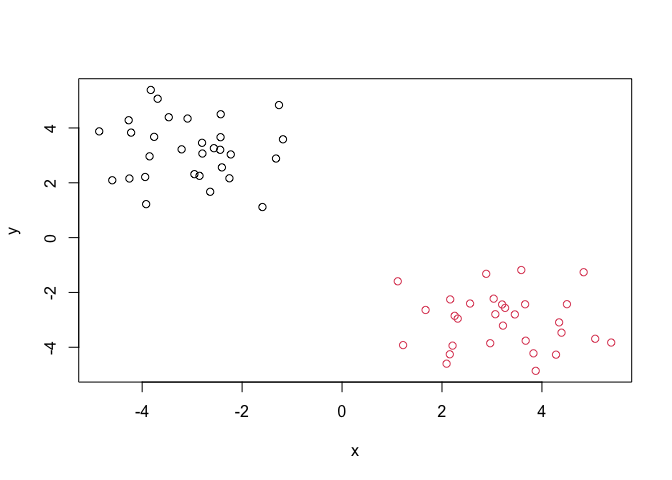
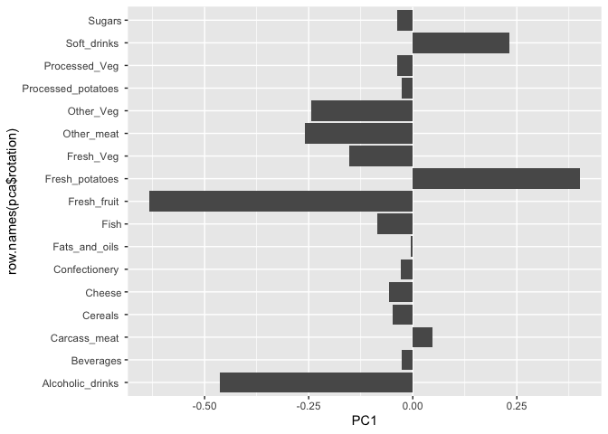

# Class 7: Machine Learning 1
Kai Christman (A17522126)

- [Background](#background)
- [K-means clustering](#k-means-clustering)
- [Hierarchical Clustering](#hierarchical-clustering)
- [Principal Component Analysis
  (PCA)](#principal-component-analysis-pca)
- [Analysis of UK Food Data](#analysis-of-uk-food-data)
- [Tidy Data](#tidy-data)
- [Previewing the First 6 rows of the
  data](#previewing-the-first-6-rows-of-the-data)
- [Exploratory Analysis](#exploratory-analysis)
- [PCA](#pca)

## Background

Today we will explore some core machine learning methods that are very
popular in bioinformatics. These include **clustering** and
**dimensionality reduction**. The goal of **clustering** is to find
groups within the data.

## K-means clustering

The meain function in “base” R for K-means clustering is called
`kmeans()`.

Before we dive too deeply, let’s make up some “simple” data that we can
cluster and know if we are getting a good answer. To assist with this
process we can use `rnorm()` function:

``` r
hist( rnorm(1000, mean = 3, sd = 1) )
```



``` r
x <- c( rnorm(30, -3), rnorm(30, 3) )
x
```

     [1] -4.221302 -2.428097 -3.920624 -4.598621 -2.431503 -1.182214 -1.321452
     [8] -2.794685 -3.690184 -2.254057 -3.760684 -2.801740 -1.262203 -3.467599
    [15] -4.270035 -3.092083 -2.564441 -4.255601 -1.593152 -2.404321 -3.940313
    [22] -2.639356 -2.954922 -2.438514 -3.210719 -2.852658 -4.859977 -3.827706
    [29] -2.227039 -3.852225  2.964982  3.034319  5.386319  3.875983  2.253536
    [36]  3.220204  3.203124  2.314796  1.671858  2.211360  2.562023  1.115197
    [43]  2.156514  3.262547  4.343780  4.281911  4.391803  4.835180  3.458059
    [50]  3.675113  2.164306  5.065732  3.067268  2.884679  3.586685  3.663325
    [57]  2.092096  1.221302  4.500465  3.830468

The reverse function reverses the order of the vector, positives are now
first and negatives are second.

``` r
z <- cbind(x = x, y = rev(x))
z
```

                  x         y
     [1,] -4.221302  3.830468
     [2,] -2.428097  4.500465
     [3,] -3.920624  1.221302
     [4,] -4.598621  2.092096
     [5,] -2.431503  3.663325
     [6,] -1.182214  3.586685
     [7,] -1.321452  2.884679
     [8,] -2.794685  3.067268
     [9,] -3.690184  5.065732
    [10,] -2.254057  2.164306
    [11,] -3.760684  3.675113
    [12,] -2.801740  3.458059
    [13,] -1.262203  4.835180
    [14,] -3.467599  4.391803
    [15,] -4.270035  4.281911
    [16,] -3.092083  4.343780
    [17,] -2.564441  3.262547
    [18,] -4.255601  2.156514
    [19,] -1.593152  1.115197
    [20,] -2.404321  2.562023
    [21,] -3.940313  2.211360
    [22,] -2.639356  1.671858
    [23,] -2.954922  2.314796
    [24,] -2.438514  3.203124
    [25,] -3.210719  3.220204
    [26,] -2.852658  2.253536
    [27,] -4.859977  3.875983
    [28,] -3.827706  5.386319
    [29,] -2.227039  3.034319
    [30,] -3.852225  2.964982
    [31,]  2.964982 -3.852225
    [32,]  3.034319 -2.227039
    [33,]  5.386319 -3.827706
    [34,]  3.875983 -4.859977
    [35,]  2.253536 -2.852658
    [36,]  3.220204 -3.210719
    [37,]  3.203124 -2.438514
    [38,]  2.314796 -2.954922
    [39,]  1.671858 -2.639356
    [40,]  2.211360 -3.940313
    [41,]  2.562023 -2.404321
    [42,]  1.115197 -1.593152
    [43,]  2.156514 -4.255601
    [44,]  3.262547 -2.564441
    [45,]  4.343780 -3.092083
    [46,]  4.281911 -4.270035
    [47,]  4.391803 -3.467599
    [48,]  4.835180 -1.262203
    [49,]  3.458059 -2.801740
    [50,]  3.675113 -3.760684
    [51,]  2.164306 -2.254057
    [52,]  5.065732 -3.690184
    [53,]  3.067268 -2.794685
    [54,]  2.884679 -1.321452
    [55,]  3.586685 -1.182214
    [56,]  3.663325 -2.431503
    [57,]  2.092096 -4.598621
    [58,]  1.221302 -3.920624
    [59,]  4.500465 -2.428097
    [60,]  3.830468 -4.221302

``` r
plot(z)
```



Now we can run `kmeans()` on this input `z` and see what the results
look like!

``` r
km <- kmeans(x = z, centers = 2)

km
```

    K-means clustering with 2 clusters of sizes 30, 30

    Cluster means:
              x         y
    1 -3.037268  3.209831
    2  3.209831 -3.037268

    Clustering vector:
     [1] 1 1 1 1 1 1 1 1 1 1 1 1 1 1 1 1 1 1 1 1 1 1 1 1 1 1 1 1 1 1 2 2 2 2 2 2 2 2
    [39] 2 2 2 2 2 2 2 2 2 2 2 2 2 2 2 2 2 2 2 2 2 2

    Within cluster sum of squares by cluster:
    [1] 64.43136 64.43136
     (between_SS / total_SS =  90.1 %)

    Available components:

    [1] "cluster"      "centers"      "totss"        "withinss"     "tot.withinss"
    [6] "betweenss"    "size"         "iter"         "ifault"      

``` r
attributes(km)
```

    $names
    [1] "cluster"      "centers"      "totss"        "withinss"     "tot.withinss"
    [6] "betweenss"    "size"         "iter"         "ifault"      

    $class
    [1] "kmeans"

> Q. How many points are in each cluster?

``` r
km$size
```

    [1] 30 30

> Q. What component of your result object details cluster
> assignment/membership?

``` r
km$cluster
```

     [1] 1 1 1 1 1 1 1 1 1 1 1 1 1 1 1 1 1 1 1 1 1 1 1 1 1 1 1 1 1 1 2 2 2 2 2 2 2 2
    [39] 2 2 2 2 2 2 2 2 2 2 2 2 2 2 2 2 2 2 2 2 2 2

> Q. What component of your result obbject details cluster center?

``` r
km$centers
```

              x         y
    1 -3.037268  3.209831
    2  3.209831 -3.037268

> Q. Plot `z` colored by the kmeans cluster assignmnet and add cluster
> centers as blue points:

``` r
plot(z, col = km$cluster)
points(km$centers, co = "blue", pch=15)
```



> Q. Run a K-means clustering and plot the results asking for 4 clusters
> (K=4):

``` r
km4 <- kmeans(x = z, centers = 4)

km4$cluster
```

     [1] 3 3 3 3 3 3 3 3 3 3 3 3 3 3 3 3 3 3 3 3 3 3 3 3 3 3 3 3 3 3 1 4 2 1 4 4 4 4
    [39] 4 1 4 4 1 4 2 2 2 2 4 1 4 2 4 4 4 4 1 1 2 1

``` r
plot(z, col = km4$cluster)
points(km4$centers, col = "orange", pch=15)
```



> **N.B.** You need to tell K-means the number of clusters (i.e. set of
> `centers = 2`)!!

One approach is to try different values for `centers` and pick the best…

``` r
ans <- NULL

for(i in 1:10) {
  km <- kmeans(z, centers = i)
  ans <- c(ans, km$tot.withinss)
 
}

plot(ans, typ="o", 
     xlab = "Number of clusters", 
     ylab = "Total Sum of Squares")
```



## Hierarchical Clustering

The main function in “base” R for Hierarchical Clustering is called
`hclust()`. This will work in bottom up fashion. Starts with each data
point being in its own cluster, grouping some of them together until
everything is in one cluster at the end.

This function does not take your “raw” data for clustering. You must
first build a “distance matrix” from your data and pass this as input to
`hclust()`

``` r
d <- dist(z)
hc <- hclust(d)
```

This is a bespoke `plot()` method for `hclust()` result objects.

``` r
plot(hc)
```



``` r
plot(hc)
abline(h=8, col = "red")
```



Once we have our `hclust` object (our “tree” of cluster dendrogram”) we
can *“cut”* the tree to reveal the clustering pattern.

``` r
cutree(hc, h=8)
```

     [1] 1 1 1 1 1 1 1 1 1 1 1 1 1 1 1 1 1 1 1 1 1 1 1 1 1 1 1 1 1 1 2 2 2 2 2 2 2 2
    [39] 2 2 2 2 2 2 2 2 2 2 2 2 2 2 2 2 2 2 2 2 2 2

> Q. Make a plot of `z` with your hclust results (i.e. colored by
> cluster membership)

``` r
groups <- cutree(hc, k = 2)
plot(z, col = groups)
```



## Principal Component Analysis (PCA)

PCA is a dimensionality reduction method that is popular for revealing
patterns in complex data sets. PCA takes multi-dimensional datasets and
project them into useful ways, such as making figures. PCA aims to
reduce dimensionality in an effective way, not all columns are necessary
to evaluate the data. In the most simplistic model, with just x and y
dimensions, PCA fits a line between data, such as a regression.

## Analysis of UK Food Data

Lets look at some data on the eating habbits of people from the UK and
evalaute them to see if any patterns or trends that have some regions
being distinct from others.

\##Data Import

the dad is made available in CSV formate so we can use `read.csv()` to
import into R:

``` r
url <- "https://tinyurl.com/UK-foods"
x <- read.csv(url)
x
```

                         X England Wales Scotland N.Ireland
    1               Cheese     105   103      103        66
    2        Carcass_meat      245   227      242       267
    3          Other_meat      685   803      750       586
    4                 Fish     147   160      122        93
    5       Fats_and_oils      193   235      184       209
    6               Sugars     156   175      147       139
    7      Fresh_potatoes      720   874      566      1033
    8           Fresh_Veg      253   265      171       143
    9           Other_Veg      488   570      418       355
    10 Processed_potatoes      198   203      220       187
    11      Processed_Veg      360   365      337       334
    12        Fresh_fruit     1102  1137      957       674
    13            Cereals     1472  1582     1462      1494
    14           Beverages      57    73       53        47
    15        Soft_drinks     1374  1256     1572      1506
    16   Alcoholic_drinks      375   475      458       135
    17      Confectionery       54    64       62        41

> Q1. How many rows and columns are in your new data frame named x? What
> R functions could you use to answer this questions?

``` r
nrow(x)
```

    [1] 17

## Tidy Data

Fix anything that went wrong with data import.

## Previewing the First 6 rows of the data

``` r
head(x)
```

                   X England Wales Scotland N.Ireland
    1         Cheese     105   103      103        66
    2  Carcass_meat      245   227      242       267
    3    Other_meat      685   803      750       586
    4           Fish     147   160      122        93
    5 Fats_and_oils      193   235      184       209
    6         Sugars     156   175      147       139

``` r
dim(x)
```

    [1] 17  5

``` r
rownames(x) <- x[,1]
x <- x[,-1]
head(x)
```

                   England Wales Scotland N.Ireland
    Cheese             105   103      103        66
    Carcass_meat       245   227      242       267
    Other_meat         685   803      750       586
    Fish               147   160      122        93
    Fats_and_oils      193   235      184       209
    Sugars             156   175      147       139

``` r
dim(x)
```

    [1] 17  4

It is possible to set the row.names when reading the CSV file in, such
as the code below:

``` r
x <- read.csv(url, row.names=1)
head(x)
```

                   England Wales Scotland N.Ireland
    Cheese             105   103      103        66
    Carcass_meat       245   227      242       267
    Other_meat         685   803      750       586
    Fish               147   160      122        93
    Fats_and_oils      193   235      184       209
    Sugars             156   175      147       139

> Q2. Which approach to solving the ‘row-names problem’ mentioned above
> do you prefer and why? Is one approach more robust than another under
> certain circumstances?

I prefer the second approach as it allows the rows to be properly
assigned at the start of data analysis when the CSV files are loaded. In
addition, if you run the first example of code multiple times, it will
continue to remove rows and labels, which could be detremental to your
code.

## Exploratory Analysis

Make some plots to help make sense of obvious trends …

``` r
barplot(as.matrix(x), beside=T, col=rainbow(nrow(x)))
```


> Q5: We can use the pairs() function to generate all pairwise plots for
> our countries. Can you make sense of the following code and resulting
> figure? What does it mean if a given point lies on the diagonal for a
> given plot?

``` r
pairs(x, col=rainbow(nrow(x)), pch=16)
```


``` r
library(pheatmap)

pheatmap( as.matrix(x) )
```


**Key-point**: Even relatively small data sets can prove challenging to
interpret Given that it is quite difficult to make sense of even this
relatively small data set. Hopefully, we can clearly see that a powerful
analytical method is absolutely necessary if we wish to observe trends
and patterns in larger data sets.

## PCA

The main function in “base” R for PCA is called `prcomp()`. This
function wants the “observations” to be rows and the “variables” to be
columns.

This block of code will transpose “x” input objects

``` r
pca <- prcomp( t(x) )
summary(pca)
```

    Importance of components:
                                PC1      PC2      PC3     PC4
    Standard deviation     324.1502 212.7478 73.87622 2.7e-14
    Proportion of Variance   0.6744   0.2905  0.03503 0.0e+00
    Cumulative Proportion    0.6744   0.9650  1.00000 1.0e+00

The returned PCA object has components that we can use to make our main
result figures:

``` r
attributes(pca)
```

    $names
    [1] "sdev"     "rotation" "center"   "scale"    "x"       

    $class
    [1] "prcomp"

The main result figure form this analysis is called a “PC Score plot” or
“ordenation plot” or “PC Plot” or PC1 vs PC2 plot. How does your data
lie along the new things that we have calculated? This is a reduced
dimension space, reducing what is needed to describe the relationship
between these countries, for exampls.

This plot shows how samples (in this case countries) relate to each
other along our new PC axis. (PC1 carries 67% of the variance, so it is
more important as a representation of the data.)

``` r
library(ggplot2)

ggplot(pca$x) +
  aes(PC1, PC2) + 
  geom_point()
```


``` r
countrycols <- c("orange", "red", "blue", "darkgreen")

pca$x
```

                     PC1         PC2        PC3           PC4
    England   -144.99315   -2.532999 105.768945  1.612425e-14
    Wales     -240.52915 -224.646925 -56.475555  4.751043e-13
    Scotland   -91.86934  286.081786 -44.415495 -6.044349e-13
    N.Ireland  477.39164  -58.901862  -4.877895  1.145386e-13

``` r
ggplot(pca$x) +
  aes(PC1, PC2, label) + 
  geom_point( col = countrycols ) 
```


``` r
ggplot(pca$x) +
  aes(PC1, PC2, label = row.names(pca$x) ) + 
  geom_point( col = countrycols ) +
  geom_text(size = 3, vjust=2, col=countrycols)
```


We can see that Northern Ireland is the most different as calcualted by
PCA, but why? Using `pca$rotation` we can observe all the calculations
for each PC as calculated by PCA.

``` r
ggplot(pca$rotation) +
  aes(PC1, row.names(pca$rotation)) +
  geom_col()
```



The barchart of columns above shows that fresh potatoes and soft drinks
contribute heavily to N. Irelands skewed results and high PCA variance.

**IMPORTANT TAKEAWAYS** PC Score Plots, Loading Plots, and Scree plots
are the most important takeaways from today’s lab. A PC score plot shows
how observations score within each principal component, with the axes
usually representing the 2 most important components that help to
clarify and explain trends in the data. A loading plot highlights all of
the variables that are weighted by principal components and show what
variables contribute heavily to the PC score. A scree plot describes
variance, ultimately displaying each principal component and what the
level of variance each new principal component will highlight. Most
informaticians will use a Scree Plot to find the “elbow” flexion point
to analyze which principal components are truly needed to fully analyze
and interpret the data.
