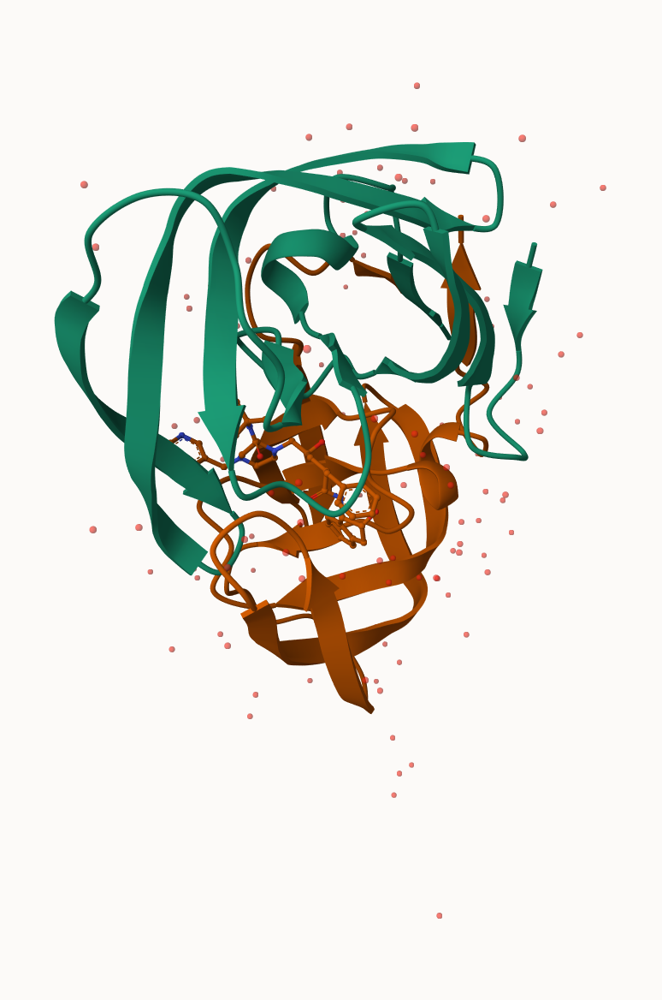
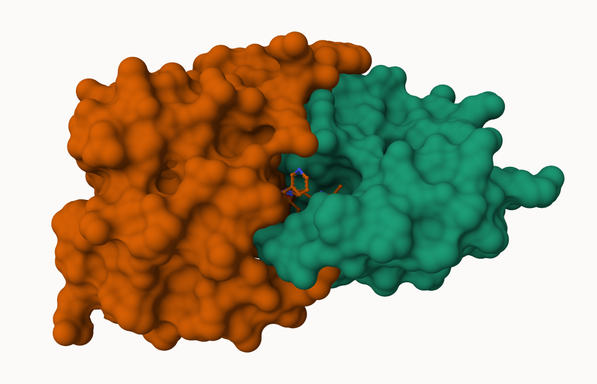
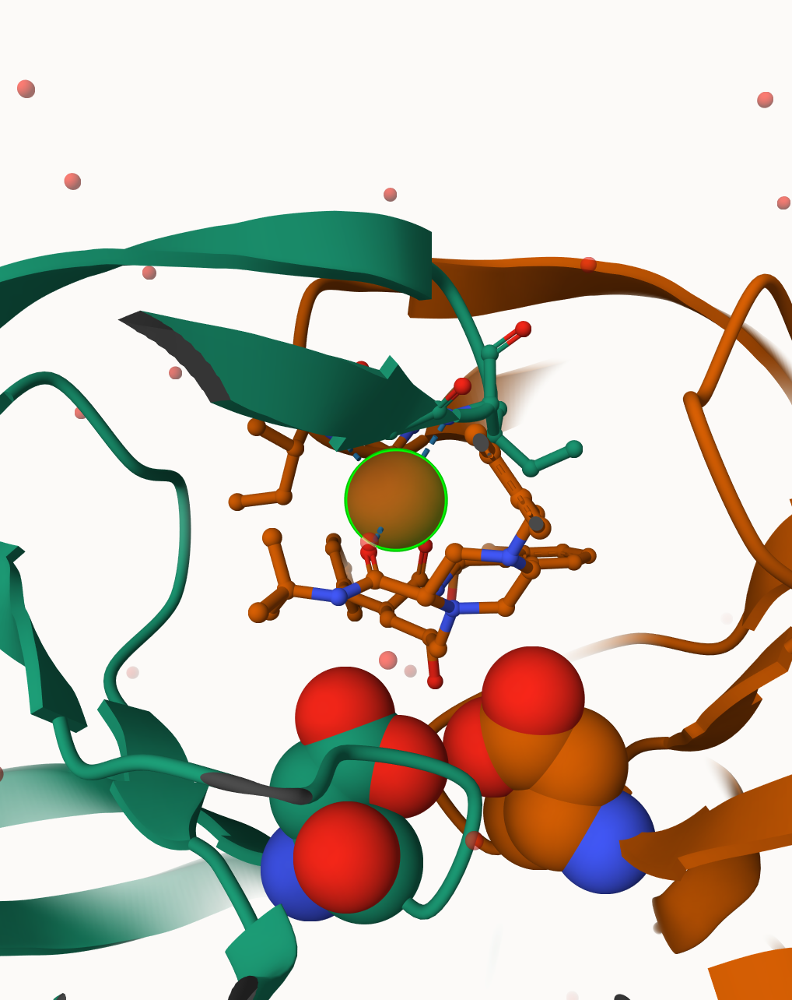

## Background
The main repistory for high-resolution structural data on biomolecules is called the **Protein Data Bank (PDB)**. 


## PDB Statistics
What is in the PDB in terms of molecule type and structure determination method? 

Read a CSV file of current PDB stats obtained from:
https://www.rcsb.org/stats/summary
```{r}
pdb <- read.csv("data export summary.csv")
pdb
```

Seems like the data for some of these mesuarements is in Characters rather than integers, due to the presence of a comma! We can fix this with the following code, utilizing the `gsub()` and the `as.numeric()` functions:
```{r}
cols_to_fix <- c("X.ray", "EM", "NMR")

rm.comma <- pdb[cols_to_fix] <- lapply(pdb[cols_to_fix], function(x) {
  as.numeric(gsub(",", "", x))
})

pdb
```

We could also use a different import function: `read_csv`  from the **readr** package. This CSV importer speaks "American" (i.e. deals with commas in numbers in a comma seperated value file).
```{r}
library(readr)

pdb_data <- read_csv("data export summary.csv")

pdb_data
```


> Q1: What percentage of structures in the PDB are solved by X-Ray and Electron Microscopy.

```{r}
n.tot <- sum(pdb_data$Total)
n.xray <- sum(pdb_data$`X-ray`)
n.EM <- sum(pdb_data$EM)

xray_pct <- n.xray / n.tot
EM_pct <- n.EM / n.tot

xray_pct
EM_pct
```

> Q2: What proportion of structures in the PDB are protein?

```{r}
total_protein <- pdb_data$Total[1]

(total_protein / 202556314) * 100
```

The total number of protein sequences is: 202,556,314. (This is sourced from UniProt)
> **Key-point**: We have a very, very small strucutural coverage of known proteins (~0.1%). Most structures we know about (~80%) come from one method (X-ray crsytalography).

**SKIPPED THIS QUESTION IN LAB**
> Q3: Type HIV in the PDB website search box on the home page and determine how many HIV-1 protease structures are in the current PDB?


## Visualizing PDB data with Mol-star
Main stand alone web version with all features is at: https://molstar.org/viewer/








