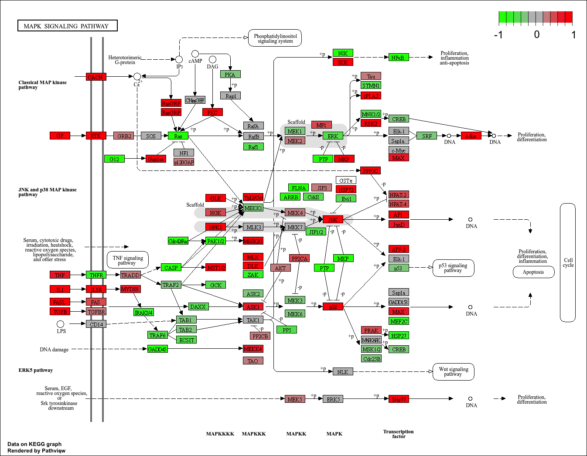

## Background
Raw lists of genes and their information can be challenging to interpret and difficult to understand. As a result, we can use different packages in R to sift through gene databases and reduce the complexity of mapping them to known biological functions, processes and pathways. This section focuses on the HOXA1 developmental transcription factor which is required for ling fibroblast and HeLa cell cycle progression.  

## Data Import
Read counts and metadata CSV files
```{r}
library(DESeq2)

metaFile <- "GSE37704_metadata.csv"
countFile <- "GSE37704_featurecounts.csv"

# Import metadata and take a peek
colData = read.csv(metaFile, row.names=1)
head(colData)

# Import countdata
countData = read.csv(countFile, row.names=1)
head(countData)
```

## Sannity Check
> Q. Complete the code below to remove the troublesome first column from countData:

```{r}
countData = as.matrix(countData[, -1])
head(countData)
```

## Setup DESeq object and Run DESeq Analysis pipeline

> Q. Complete the code below to filter countData to exclude genes (i.e. rows) where we have 0 read count across all samples (i.e. columns).

```{r}
countData = countData[rowSums(countData) > 0, ]
head(countData)
```

How many genes are left after filtering?
```{r}
dim(countData)
```

## Extract the results
Big Table with log2 fold changes and p-values
```{r}
dds = DESeqDataSetFromMatrix(countData= countData,
                             colData= colData,
                             design= ~condition)
 dds = DESeq(dds)
 res <- results(dds)
 dds
 res
```

> Q: Call the summary() function on your results to get a sense of how many genes are up or down-regulated at the default 0.1 p-value cutoff.

```{r}
summary(res)
```

## Data Viz - Volcano Plot
```{r}
library(ggplot2)

res$threshold <- "not significant"
res$threshold[res$log2FoldChange >= 2 & res$padj <= 0.05] <- "up"
res$threshold[res$log2FoldChange <= -2 & res$padj <= 0.05] <- "down"

ggplot(res) +
  aes(log2FoldChange, -log(padj), color = threshold) +
  geom_point() +
  geom_vline(xintercept = c(-2, 2), col = "red") +
  geom_hline(yintercept = -log(0.05), col = "red") +
  scale_color_manual(values = c("down" = "blue", "not significant" = "gray", "up" = "red")) 

res <- res[order(res$padj), ]

write.csv(res, file = "deseq_results.csv")
```

## Add Annotation data
> Q. Use the mapIDs() function multiple times to add SYMBOL, ENTREZID and GENENAME annotation to our results by completing the code below.

Add gene symbol and entrez ids:
```{r}
library("AnnotationDbi")
library("org.Hs.eg.db")

columns(org.Hs.eg.db)

res$symbol = mapIds(org.Hs.eg.db,
                    keys = row.names(res), 
                    keytype="ENSEMBL",
                    column= "SYMBOL",
                    multiVals="first")

res$entrez = mapIds(org.Hs.eg.db,
                    keys=row.names(res),
                    keytype="ENSEMBL",
                    column="ENTREZID",
                    multiVals="first")

res$name =   mapIds(org.Hs.eg.db,
                    keys=row.names(res),
                    keytype="ENSEMBL",
                    column="GENENAME",
                    multiVals="first")

head(res, 10)
```

> Q. Finally for this section let's reorder these results by adjusted p-value and save them to a CSV file in your current project directory.

```{r}
res = res[order(res$padj),]
write.csv(res, file ="deseq_results.csv")
```


## Pathway Analysis
KEGG, GO and REACTOME

```{r}
library(pathview)
library(gage)
library(gageData)

data(kegg.sets.hs)
data(sigmet.idx.hs)

# Focus on signaling and metabolic pathways only
kegg.sets.hs = kegg.sets.hs[sigmet.idx.hs]

# Examine the first 3 pathways
head(kegg.sets.hs, 3)

keggres = gage(res$log2FoldChange, gsets = kegg.sets.hs, ref = NULL)
head(keggres$less)
```

```{r}
keggrespathways <- rownames(keggres$greater)[1:5]

keggresids = substr(keggrespathways, start=1, stop=8)
keggresids

names(res$log2FoldChange) <- res$entrez

pathview(gene.data=res$log2FoldChange, pathway.id=keggresids, species="hsa")
```


> Q. Can you do the same procedure as above to plot the pathview figures for the top 5 down-regulated pathways?

```{r}
keggres_less_pathways <- rownames(keggres$less)[1:5]

keggres_less_ids = substr(keggres_less_pathways, start=1, stop=8)

names(res$log2FoldChange) <- res$entrez

pathview(gene.data=res$log2FoldChange, pathway.id=keggres_less_ids, species="hsa")

```


## REACTOME
There is an R package for this analysis and a new-ish website: https://reactome.org

To use the website you can paste or upload a list of your DEGs
```{r}
sig_genes <- res[res$padj <= 0.05 & !is.na(res$padj), "symbol"]
print(paste("Total number of significant genes:", length(sig_genes)))

write.table(sig_genes, file="significant_genes.txt", row.names=FALSE, col.names=FALSE, quote=FALSE)

```

> Q: What pathway has the most significant “Entities p-value”? Do the most significant pathways listed match your previous KEGG results? What factors could cause differences between the two methods?

The most significant "Entities p-value" pathway is "Cell Cycle, Mitotic" with a p-value of 2.63 e-5. The most significant pathways listed in the REACTOME analysis do not match the KEGG results, which could be due to differences in the underlying databases, pathway definitions, and algorithms used for enrichment analysis. Additionally, KEGG focuses on metabolic and signaling pathways, while REACTOME includes a broader range of biological processes, which may lead to different significant pathways being identified. 


